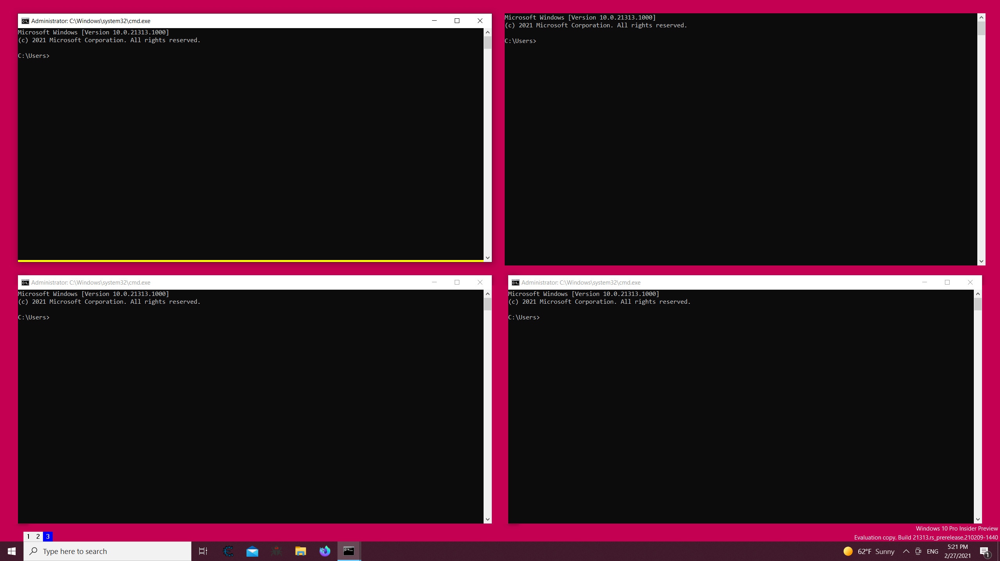

# WinWM

WinWM is a tiling window manager inspired by i3wm, it was initially private and commerical, but I decided to opensource it.

## Manual
for the config options and explanations, and a tutorial on the luajit scripting.
please check the page [here](https://mcyoloswagham.github.io/win3wm)

## Documentation
 [Documentation](https://mcyoloswagham.github.io/win3wm)
## Architecture
 * twm - is the actual Tiling Window Manager logic, that handles the trees, layouts, Config, input, etc...
 * ForceResize - is the DLL that is to be injected in all applications to allow resizing a window past its limits
 * WinHook - is the DLL that is to be injected in all applications to notify the main application of window creation/destruction.
 * x86ipc - Due to WinAPI constraints, there needs to be a child process for interacting with x86 processes
 * WinWMGUI - was the C# gui that was to be used for licensing purposes.
 
 ## Building
 * Open Developer Command Prompt for vs2019
 * Build.bat

## Features
- [x] Multi monitor support
- [x] LuaJit Scripting
- [x] Uses virtual desktops instead of just moving around windows
- [x] Performance (happy enough with it, some optimizations could be done somehow for really heavy windows like file explorer)  
 
## TODO
- [ ] focus switching on cursor movement and not hotkey
- [ ] save tree layout and restore on restart.
- [ ] CrashHandling (restart on crash)
- [ ] Focus system similar to i3wm (current focus system is basic)
- [ ] Handle disconnecting and reconnecting displays during runtime
## Issues
feel free to ask questions or put suggestions by opening an issue. I'd be glad to discuss these things
## Prerequisites
The task bar must be at the bottom of the screen and not on the sides, this is something that will hopefully be fixed soon  
## Showcase

A basic image showing the status bar on the bottom left, the windows, the gapping functionality and the ability to remove titlebars from application (top right command prompt)
and the yellow focus bar on the bottom of the current focused window.

A image showing the multimonitor version, a status bar for each monitor, with the active monitor having the color blue on the statusbar
